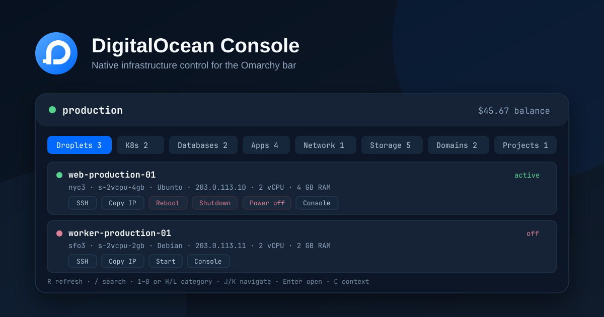

# Omarchy DigitalOcean Console

A native, theme-aware DigitalOcean command center for the Omarchy Quickshell bar.



It monitors your infrastructure through the official `doctl` CLI and its existing authentication contexts. The plugin never reads, stores, logs, or asks for an API token.

## Capabilities

- **Droplets** — state, region, image, size, public/private addressing, CPU, memory, and disk
- **Kubernetes** — cluster health, version, region, endpoint, node-pool count, and kubeconfig launch
- **Managed databases** — engine, version, health, region, size, and node count
- **App Platform** — active deployment state, region, ingress, and direct application links
- **Networking** — load balancer health, IP, algorithm, size, and attached Droplets
- **Storage** — volumes, attachment state, snapshots, capacity, and regions
- **Domains** — managed domains and TTLs
- **Projects** — environment, purpose, description, and default-project state
- **Billing** — current balance and month-to-date usage
- **Multiple accounts** — discovers and switches among existing `doctl` contexts
- **Native alerts** — health regression and low-balance notifications through `notify-send`

## Safe operations

The panel intentionally exposes a narrow action surface:

| Resource | Operations |
| --- | --- |
| Droplet | Start, graceful shutdown, emergency power off, reboot, SSH, copy address, open console |
| Kubernetes | Save kubeconfig through `doctl`, open console |
| App Platform | Open live app, open console |
| Load balancer | Copy IP, open console |
| Database, volume, snapshot, project, domain | Copy the non-secret identifier and open the relevant web console |

Shutdown, emergency power off, and reboot require explicit in-panel confirmation. The confirmation is bound to the selected `doctl` context and is invalidated if that context changes. Create, delete, destroy, rebuild, resize, restore, and credential-management operations are deliberately absent.

## Requirements

- Omarchy with Quickshell bar plugin support
- Python 3.10 or newer
- [`doctl`](https://docs.digitalocean.com/reference/doctl/how-to/install/)
- A configured `doctl` authentication context
- `wl-copy`, `notify-send`, and a Nerd Font (included with Omarchy)

Configure authentication outside the plugin:

```bash
doctl auth init

doctl account get
```

For multiple accounts:

```bash
doctl auth init --context production
doctl auth init --context staging
doctl auth list
```

Do not place DigitalOcean tokens in `shell.json`, plugin files, command arguments, screenshots, issues, or logs.

## Installation

```bash
omarchy plugin add https://github.com/craigderington/omarchy-digital-ocean.git --enable
```

Manual installation:

```bash
git clone https://github.com/craigderington/omarchy-digital-ocean.git \
  ~/.config/omarchy/plugins/cd.digitalocean
omarchy plugin validate ~/.config/omarchy/plugins/cd.digitalocean
omarchy plugin enable cd.digitalocean right
```

## Controls

### Mouse

- Left click: toggle the panel
- Middle or right click: refresh immediately
- Click a resource row: open it in the DigitalOcean web console

### Keyboard

| Key | Action |
| --- | --- |
| `1`–`8` | Select a resource category |
| `H` / `L`, `←` / `→` | Move between categories |
| `J` / `K`, `↑` / `↓` | Move through resources |
| `Enter` | Open the selected resource |
| `/` | Focus resource search |
| `C` | Open the account context picker |
| `R` | Refresh |
| `Tab` | Switch to the neighbouring bar panel |
| `Esc` | Clear search, cancel confirmation, or close |

## Configuration

Configure the widget through Omarchy's plugin settings UI or `~/.config/omarchy/shell.json`:

```json
{
  "plugins": {
    "cd.digitalocean": {
      "refreshIntervalSec": 60,
      "idleRefreshIntervalSec": 600,
      "notificationsEnabled": true,
      "lowBalanceThreshold": 10
    }
  }
}
```

| Setting | Default | Range | Purpose |
| --- | ---: | ---: | --- |
| `refreshIntervalSec` | 60 | 30–3600 | Poll interval while the panel is open |
| `idleRefreshIntervalSec` | 600 | 60–7200 | Poll interval while closed; clamped to the open interval |
| `notificationsEnabled` | `true` | — | Health-regression and low-balance notifications |
| `lowBalanceThreshold` | 10 | 0–10000 | Urgent state below this positive USD balance; `0` disables it |

A failed service request is reported independently. For example, missing database permissions will not make healthy Droplets disappear or appear as an empty account.

## `doctl` access

Read-only display uses the access needed by the corresponding `doctl ... list` and `account`/`balance` commands. Droplet power controls additionally require write access for Droplet actions. DigitalOcean team roles and scoped tokens remain authoritative.

The helper:

- invokes `doctl` with argument arrays and `--interactive=false`, never a shell;
- applies strict allowlists to mutations and disables HTTP retries for them;
- re-fetches a Droplet immediately before an action and rejects incompatible state transitions;
- accepts only numeric Droplet IDs for power actions;
- removes connection credentials and other secrets from normalized output;
- parses structured CLI errors without surfacing raw database output;
- preserves the last successful category snapshot and marks partial refresh failures instead of replacing data with a false empty state;
- continues rendering successful resource categories when another category fails.

## Development

```bash
python3 -m unittest discover -s tests -v
node tests/test_model.mjs
omarchy plugin validate .
```

The CI workflow runs the portable Python, JavaScript, and source-policy suites. Runtime QML verification is performed against Omarchy's installed shell because `qs.Ui` and `qs.Commons` are Omarchy modules.

## License

MIT © 2026 Craig Derington
